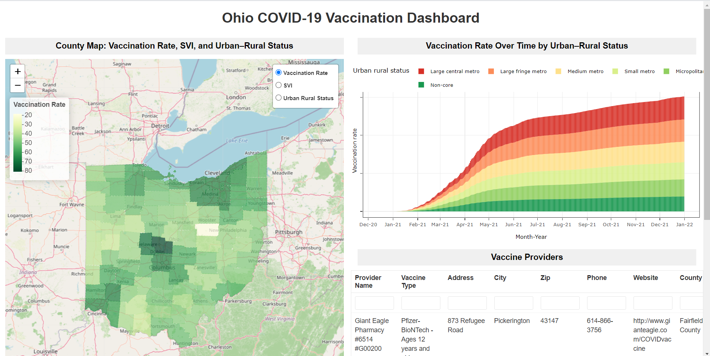

# Ohio COVID-19 Vaccination Dashboard

An R Shiny app for exploring 2021 COVID-19 vaccination in Ohio. It shows a county map, vaccination over time by urban–rural status, and a searchable list of vaccine providers.

The three files in `data/` are analysis-ready extracts prepared from publicly available sources.

## What the app shows

**County Map: Vaccination Rate, SVI, and Urban–Rural Status.** One county layer is visible at a time. The radio buttons switch among:

- COVID-19 vaccination rate
- Social Vulnerability Index (SVI)
- Urban–rural status

The legend matches the selected layer. Hover over a county to see its name and the details for the selected layer.

**Vaccination Rate Over Time by Urban–Rural Status.** Stacked bars of the vaccination rate for year 2021, colored by urban–rural status. Hover over a bar to see the urban–rural status, the date, and the vaccination rate.

**Vaccine Providers.** Provider name, vaccine type, address, city, ZIP code, phone, website, and county. Each column has a filter input directly under the column name. Type in that box to show only the providers that match. For example, enter a ZIP code in the Zip filter to see providers in that ZIP code, or a city name in the City filter to see providers in that city.

## How to run it

1. Install [R](https://cran.r-project.org/) and [RStudio](https://posit.co/download/rstudio-desktop/). Skip this step if R and RStudio are already installed.
2. [Download the project as a ZIP file](https://github.com/yogitakarale/ohio-covid-19-vaccination-dashboard/archive/refs/heads/main.zip) and unzip it. Or clone the repository: `git clone https://github.com/yogitakarale/ohio-covid-19-vaccination-dashboard.git`
3. From the project folder, open `app.R` with RStudio, then click **Run App**. The **Run App** button is at the top right of the script editor.

The first run installs any missing packages and can take several minutes.The dashboard then opens in a window.

Packages used: `shiny`, `tidyverse`, `sf`, `leaflet`, `plotly`, `reactable`, and `rstudioapi`.

## Data

| File | Contents |
| --- | --- |
| `data/oh_county_data.geojson` | Ohio counties with vaccination rate, number vaccinated, SVI, SVI category, urban–rural status, and percent uninsured |
| `data/vax_rate_over_time.csv` | Daily vaccinated count, population, and vaccination rate by urban–rural status, for year 2021 |
| `data/vax_providers.csv` | Vaccine provider locations, including name, vaccine type, address, and county |

Urban–rural categories follow the six groups used in the time-series file: large central metro, large fringe metro, medium metro, small metro, micropolitan, and non-core.
